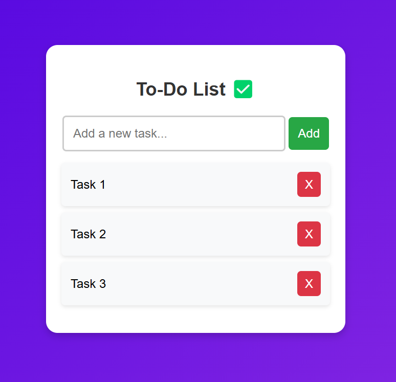

# Simple To-Do List

A simple, interactive to-do list application built using **JavaScript**, **HTML**, and **CSS**. This project allows users to add, remove, and mark tasks as completed, providing an easy way to manage daily tasks.

## Features:
- Add new tasks to your to-do list
- Mark tasks as completed or incomplete
- Delete tasks when done
- Simple, clean, and user-friendly interface
- Tasks are stored locally (so the list persists even after refreshing the page)

## Technologies Used:
- **HTML**: Used to create the structure and layout of the to-do list
- **CSS**: Applied for styling, including layout, colors, and overall design
- **JavaScript**: Handles the logic for adding, removing, and marking tasks as completed

  

